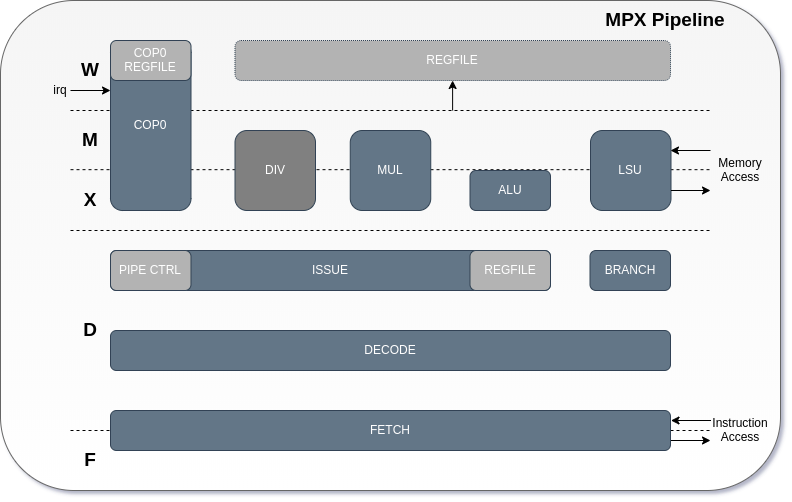

# MPX

Github: [https://github.com/ultraembedded/core_mpx](https://github.com/ultraembedded/core_mpx)

MPX is an open-source CPU which can execute code compiled for MIPS-I ISA (as per the MIPS R2000 / R3000 CPUs).

*Disclaimer: I am not associated with MIPs Technologies Inc.  
The version of MIPS ISA implemented here is 30+ years old, so undoubtedly any patents related to it will have expired.  
This core was implemented using only publically available ISA documentation.*

This core is not a good starting point for new designs. You should consider using RISC-V based designs instead, as RISC-V is a cleaned up and more modern RISC ISA that is also open-source.

I have designed multiple RISC-V cores that you should consider instead of MPX;
* [https://github.com/ultraembedded/biriscv](https://github.com/ultraembedded/biriscv)
* [https://github.com/ultraembedded/riscv](https://github.com/ultraembedded/riscv)

## Rationale
So why design this core? Well... There are some interesting real-world products that featured MIPS R3000 CPUs such as the Sony Playstation 1, and there are ongoing efforts to recreate them in modern FPGA technology. 

## Overview

## Features
* 32-bit MIPS-I ISA compatible CPU core.
* Simple 5-stage pipelined design.
* Support for external co-processors (COP1 - 3).
* Synthesizable Verilog 2001, Verilator and FPGA friendly.

Note: This core does not have a built-in floating-point unit (COP1), however, one can be implemented and connected to the top-level ports of the design.

## Status
This is a very early release of the RTL. There are likely to be bugs!

Known items on the TODO list are;
* Implement faults on invalid instructions (RI) and arithmetic overflow (OV).
* Optimise the instruction decoder to be smaller and have a shorter critical path.
* Re-implement various bugs and quirks found in actual MIPS R2000/3000 designs.
* Rework multiply/divide instructions to be non-blocking (the current implementation is faster than the original but blocking).
* Rework the co-processor interfaces to reduce the CPU critical path.
* More extensive verification is required.

